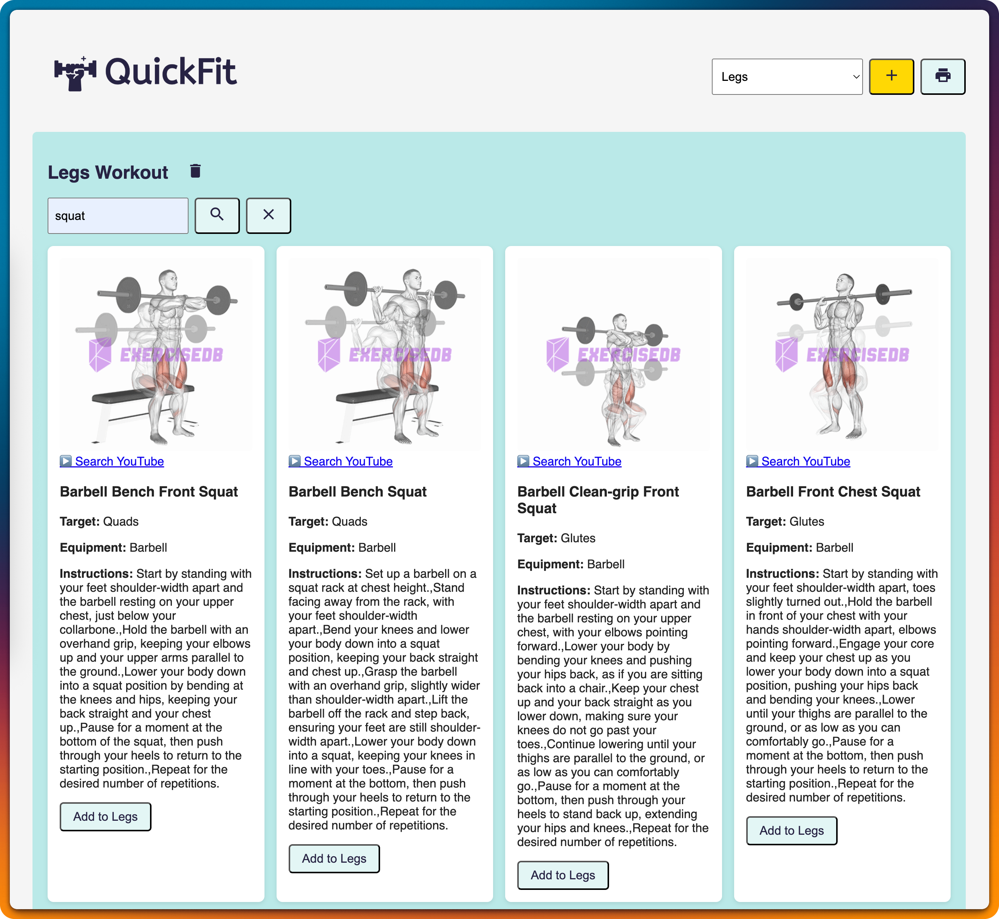
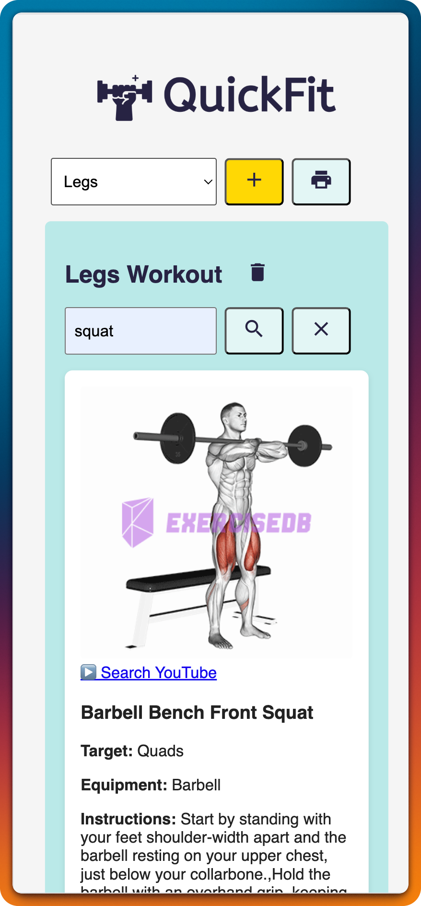
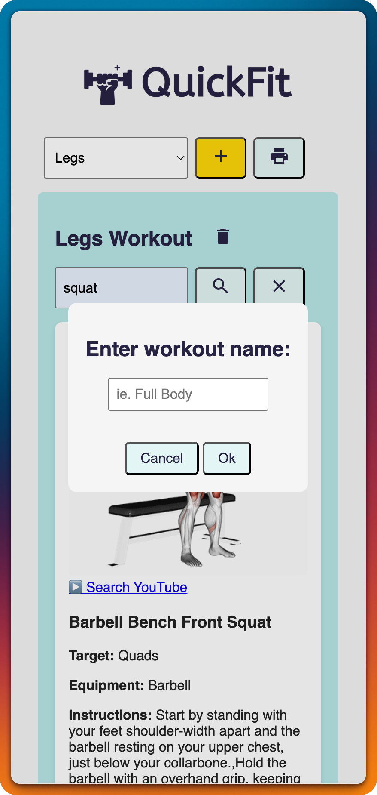

# 💪 QuickFit

A responsive workout builder that lets you create and view custom workout routines using data from the [ExerciseDB API](https://rapidapi.com/justin-WFnsXH_t6/api/exercisedb/). It’s mobile-friendly and gym-ready — perfect for building and performing workouts on the go.

[Live Demo](https://quickfit-workout-builder.netlify.app/)  

---

## 📸 Screenshots

  
  
  

## ✨ Features

- ✅ Create multiple named workout routines (Workout A, Workout B, etc.)
- 🔍 Search exercises by name (ie. 'pull-up')
- 🏋️‍♂️ Each exercise card displays:
  - Exercise name
  - Target muscle group
  - Equipment required
  - Animated demo GIF
  - Instructions
  - Link to search for exercise on YouTube
- ➕ Add/remove workouts
- 💪 Add/remove exercises from a selected workout
- 📋 Log sets with reps and weight
- 💾 Automatically saves data using `localStorage`
- 🖨️ Option to print workouts if desired

---

## 🧰 Built With

- HTML, CSS, vanilla JavaScript
- [ExerciseDB API](https://rapidapi.com/justin-WFnsXH_t6/api/exercisedb/)
- Netlify (Hosting + Functions)
- Responsive design (mobile-first)
